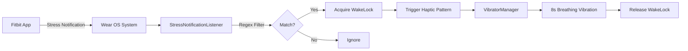

# Auto-Calm - Wear OS Stress Response Haptic Feedback

<div align="center">


**A resilient Wear OS application that provides gentle haptic breathing guidance in response to stress notifications**

[](https://wearos.google.com/)
[](https://android-arsenal.com/api?level=31)
[](https://kotlinlang.org)
[](LICENSE)

</div>

---

## 📖 Overview

**Auto-Calm** is a Wear OS application designed to help users manage stress through gentle haptic feedback. When stress-related notifications are detected (e.g., from Fitbit's Body Response/EDA features), the app triggers a custom 8-second "breathing" haptic pattern on your smartwatch, encouraging mindful breathing and stress relief.

### ✨ Key Features

- **🔔 Smart Notification Interception**: Monitors notifications from health apps (Fitbit, etc.) using regex-based channel filtering
- **💆 Custom Haptic Breathing Pattern**: 8-second gentle vibration sequence (2.5s inhale ramp → 3s pause → 2.5s exhale fade)
- **🔋 Background Resilience**: Designed as a "zombie" service that persists in the background without being killed by system power management
- **⚡ Hardware-Optimized**: Uses modern `VibratorManager` API with `USAGE_ALARM` attributes to bypass Wear OS haptic suppression
- **🎨 Premium Design**: Custom adaptive icons and clean notification UI

---

## 🚀 Quick Start

### Prerequisites

- **Wear OS Device**: Physical device running Wear OS 5/6 (API 31+) or emulator
- **Android Studio**: Latest stable version (Hedgehog or newer)
- **ADB**: For deployment and testing

### Installation

1. **Clone the repository**:
   ```bash
   git clone https://github.com/YOUR_USERNAME/auto-calm.git
   cd auto-calm
   ```

2. **Open in Android Studio**:
   - Open the `auto_calm` folder as a project
   - Sync Gradle dependencies

3. **Deploy to device**:
   ```bash
   # Via Gradle
   .\gradlew.bat installDebug
   
   # Or via ADB (for physical device)
   adb -s <device_ip> install -r auto_calm/app/build/outputs/apk/debug/app-debug.apk
   ```

4. **Grant Notification Access**:
   - Open the app on your watch
   - Follow the onboarding checklist to enable notification access
   - Settings → Apps → Special app access → Notification access → Auto-Calm

---

## 🎯 How It Works

### Architecture



### Notification Filtering

The app uses a **regex-based filter** to catch stress-related notifications:
- **Package**: `com.fitbit.FitbitMobile` or `com.example.wearnotifications` (test app)
- **Channel ID Regex**: `(?i).*(body|response|stress|eda).*`

This ensures compatibility even if Fitbit changes channel naming slightly.

### Haptic Pattern Details

The 8-second breathing pattern is designed for comfort and effectiveness:

| Phase | Duration | Intensity | Description |
|-------|----------|-----------|-------------|
| **Inhale** | 2.5s | 10% → 50% | Smooth ramp-up (amplitude 25 → 127) |
| **Pause** | 3.0s | 0% | Silent hold |
| **Exhale** | 2.5s | 50% → 10% | Gentle fade-out (amplitude 127 → 25) |

Implemented with `VibrationEffect.createWaveform()` using 250ms granular steps for smoothness.

---

## 🛠️ Technical Details

### Tech Stack

- **Language**: Kotlin
- **UI Framework**: Jetpack Compose for Wear OS
- **Target SDK**: API 35
- **Min SDK**: API 31 (Wear OS 3.0+)

### Key Components

#### 1. `StressNotificationListener.kt`
- Extends `NotificationListenerService`
- Intercepts and filters notifications
- Triggers haptic feedback via `VibratorManager`
- Uses `PowerManager.WakeLock` to ensure full pattern completion

#### 2. `MainActivity.kt`
- Onboarding UI with notification access status
- "Test Haptics" button for manual testing
- Built with Jetpack Compose for Wear OS

#### 3. Permissions (`AndroidManifest.xml`)
```xml
<uses-permission android:name="android.permission.VIBRATE" />
<uses-permission android:name="android.permission.WAKE_LOCK" />
<uses-permission android:name="android.permission.BIND_NOTIFICATION_LISTENER_SERVICE" />
<uses-permission android:name="android.permission.POST_NOTIFICATIONS" />
```

### Bypassing Wear OS Haptic Suppression

Wear OS aggressively suppresses background vibrations. Auto-Calm overcomes this with:

1. **`VibrationAttributes`** with `USAGE_ALARM` and `FLAG_BYPASS_INTERRUPTION_POLICY`
2. **`WakeLock`** (`PARTIAL_WAKE_LOCK`) to prevent CPU sleep during the 8s pattern
3. **Modern `VibratorManager`** API (API 31+) instead of deprecated `Vibrator`

---

## 🧪 Testing

### Using the ADB Notification Tester

A companion app (`ADB Notification Tester`) is included for simulating Fitbit notifications:

```powershell
# Send mock stress notification
adb -s <device_ip> shell am broadcast `
  -a com.example.wearnotifications.SEND_NOTIFICATION `
  -n com.example.wearnotifications/.NotificationReceiver `
  --es title "Body Response Alert" `
  --es message "High stress detected" `
  --es channel "body_response"
```

### Verification Commands

```powershell
# View app logs
adb -s <device_ip> logcat -d StressViber:V *:S

# Check haptic history (detailed hardware logs)
adb -s <device_ip> shell dumpsys vibrator_manager
```

---

## 📱 Screenshots

### App Interface


### Notification Icon


---

## 🤝 Contributing

Contributions are welcome! Please feel free to submit a Pull Request. For major changes, please open an issue first to discuss what you would like to change.

### Development Setup

1. Fork the repository
2. Create your feature branch (`git checkout -b feature/AmazingFeature`)
3. Commit your changes (`git commit -m 'Add some AmazingFeature'`)
4. Push to the branch (`git push origin feature/AmazingFeature`)
5. Open a Pull Request

---

## 📄 License

This project is licensed under the MIT License - see the [LICENSE](LICENSE) file for details.

---

## 🙏 Acknowledgments

- Built for Wear OS 5/6 (Pixel Watch 2 tested)
- Designed to work seamlessly with Fitbit's Body Response/EDA stress detection
- Inspired by mindfulness and stress management best practices

---

## 📞 Support

If you encounter any issues or have questions:
- Open an issue on GitHub
- Check the [Wiki](../../wiki) for troubleshooting guides

---

<div align="center">

**Made with ❤️ for stress-free living**

[Report Bug](../../issues) · [Request Feature](../../issues)

</div>
